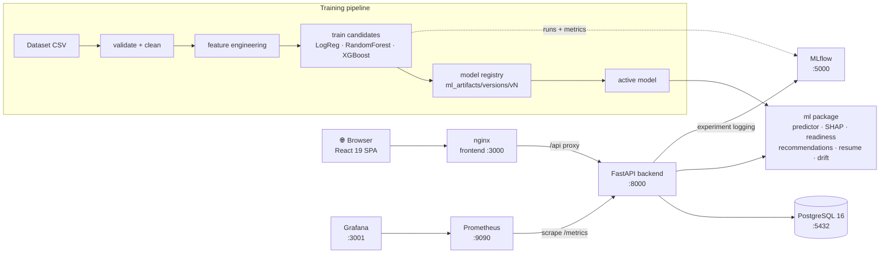

<div align="center">

# 🎓 VaniAI

### AI-Powered Placement Prediction & Career Readiness Platform

*Predict placement outcomes, explain them with SHAP, and turn insights into actionable career guidance — for students, faculty, placement officers, and admins.*


</div>

---

## What is VaniAI?

VaniAI is a production-grade platform that predicts a student's placement probability from academic, skill, and experience signals, explains every prediction with SHAP feature attributions, computes multi-dimensional career-readiness scores, analyzes resumes for ATS compatibility, and recommends concrete improvement actions and career paths. A full MLOps loop — experiment tracking, versioned model registry, drift detection, and retraining — keeps the model honest in production.

## Features by role

### 🧑‍🎓 Students
- **Placement prediction** with probability, risk level (`low` / `medium` / `high`), and human-readable risk reasons
- **Explainable AI** — SHAP-based top positive/negative factors and feature importance charts
- **Career readiness scores** across academic, technical, communication, and industry dimensions
- **Resume analyzer** — PDF upload with resume score, ATS score, extracted skills/projects, missing sections, and suggestions
- **Personalized recommendations** (coding, aptitude, communication, resume, academics, experience, certification, interview) with priorities
- **Career matching** — top-5 role matches (Software Engineer, Data Scientist, ML Engineer, …) with match scores and reasons
- **Progress tracking** — historical academic, skill, and prediction trends
- **PDF report** download of the full profile and prediction

### 👩‍🏫 Faculty
- Department/batch **analytics dashboard** — averages, risk distribution, skill radar, top performers and weak students
- **Student directory** with filters (department, batch, risk level, search) and drill-down detail pages
- **Student comparison** — side-by-side skill/readiness comparison for 2–4 students
- **Mock interview score entry** with computed interview readiness and suggestions

### 🏢 Placement Officers
- **Placement dashboard** — probability distribution, department comparison, risk donut, risk heatmap (department × batch), top skills and common weak skills
- **At-risk student list** with risk reasons and one-click **CSV export**
- Department-level analytics and **PDF reports**

### 🛠️ Admins
- **User management** (create, update, activate/deactivate, role assignment)
- **Dataset uploads** with automatic schema validation
- **Model training** — LogisticRegression vs RandomForest vs XGBoost, best-by-ROC-AUC selection, MLflow experiment tracking
- **Model registry** — versioned artifacts (`v1`, `v2`, …) with one-click deploy and hot predictor reload
- **Monitoring** — system health, Evidently data drift, PSI prediction drift, drift history, retraining trigger, Grafana dashboards

## Tech stack

| Layer | Technology |
|---|---|
| Frontend | React 19, TypeScript, Vite 6, TailwindCSS 3.4, shadcn/ui-style components (Radix), Framer Motion, React Hook Form + Zod, TanStack Query v5, Recharts 2, React Router v7, axios, lucide-react, sonner |
| Backend | Python 3.12, FastAPI, SQLAlchemy 2.0, PostgreSQL 16, Alembic, Pydantic v2 + pydantic-settings, python-jose (JWT), passlib/bcrypt |
| ML | scikit-learn, XGBoost, pandas, numpy, SHAP, joblib, pypdf, reportlab |
| MLOps | MLflow, DVC, Evidently 0.4.40, Prometheus (prometheus-fastapi-instrumentator), Grafana, Docker, GitHub Actions |

## Architecture



Deep dives: [Architecture](docs/ARCHITECTURE.md) · [MLOps lifecycle](docs/MLOPS.md)

## Quickstart

### Option A — Docker Compose (recommended)

```powershell
git clone https://github.com/your-org/VaniAI.git
cd VaniAI
docker compose up -d --build

# seed demo users, 150 synthetic students, dataset, first trained model, predictions
docker compose exec backend python -m scripts.seed
```

Then open:

| Service | URL |
|---|---|
| Frontend | http://localhost:3000 |
| API docs (Swagger) | http://localhost:8000/docs |
| Health check | http://localhost:8000/health |
| MLflow | http://localhost:5000 |
| Prometheus | http://localhost:9090 |
| Grafana | http://localhost:3001 |

### Option B — Local development

Backend (requires PostgreSQL 16 running locally with database `vaniai`, user `vaniai`, password `vaniai`):

```powershell
cd backend
py -3.12 -m venv .venv
.\.venv\Scripts\Activate.ps1
pip install -r requirements.txt
Copy-Item .env.example .env
alembic upgrade head
python -m scripts.seed
uvicorn app.main:app --reload --port 8000
```

Frontend (dev server on http://localhost:5173, proxies `/api` → `http://localhost:8000`):

```powershell
cd frontend
npm install
npm run dev
```

Full step-by-step instructions (including PostgreSQL setup and troubleshooting): [docs/INSTALLATION.md](docs/INSTALLATION.md)

## Demo credentials

Created by the seed script (`python -m scripts.seed`):

| Role | Email | Password |
|---|---|---|
| Admin | `admin@vaniai.io` | `Admin@123` |
| Faculty | `faculty@vaniai.io` | `Faculty@123` |
| Placement Officer | `placement@vaniai.io` | `Placement@123` |
| Student | `student@vaniai.io` | `Student@123` |

The seed also creates 150 synthetic students across all six departments (`CSE`, `IT`, `ECE`, `EEE`, `MECH`, `CIVIL`), a 2,000-row training dataset, a first trained model, and predictions for every student.

## Screenshots

> 📸 *Screenshots coming soon — student dashboard, SHAP explanation view, placement risk heatmap, admin monitoring page.*

<!--
| Student dashboard | Placement heatmap |
|---|---|
|  |  |
-->

## Documentation

| Document | Contents |
|---|---|
| [docs/INSTALLATION.md](docs/INSTALLATION.md) | Prerequisites, Docker & manual setup, `.env` walkthrough, troubleshooting |
| [docs/DEPLOYMENT.md](docs/DEPLOYMENT.md) | Production Docker Compose, GHCR images, TLS, scaling, backups |
| [docs/ARCHITECTURE.md](docs/ARCHITECTURE.md) | Clean-architecture layers, diagrams, database schema, design decisions |
| [docs/API.md](docs/API.md) | Full endpoint reference, auth flow, examples, conventions |
| [docs/MLOPS.md](docs/MLOPS.md) | ML lifecycle, MLflow, DVC, drift detection, metrics, retraining policy |
| [docs/USER_GUIDE.md](docs/USER_GUIDE.md) | Per-role walkthroughs of every feature |
| [docs/CONTRACTS.md](docs/CONTRACTS.md) | Binding build spec (source of truth for all modules) |

## Project layout

```
VaniAI/
├── backend/          FastAPI app (routers → services → repositories → models)
│   ├── app/          API, core config, schemas, services
│   ├── ml/           standalone ML package (training, inference, monitoring)
│   ├── scripts/      seed script
│   └── tests/        pytest suite
├── frontend/         React 19 + TypeScript + Tailwind SPA
├── mlops/            Prometheus & Grafana provisioning
├── data/             sample dataset (DVC-tracked)
├── docs/             documentation
└── docker-compose.yml
```

## License

This project is licensed under the [MIT License](https://opensource.org/licenses/MIT).

---

<div align="center">
Built with ❤️ as a production-grade reference implementation of an end-to-end ML product.
</div>
