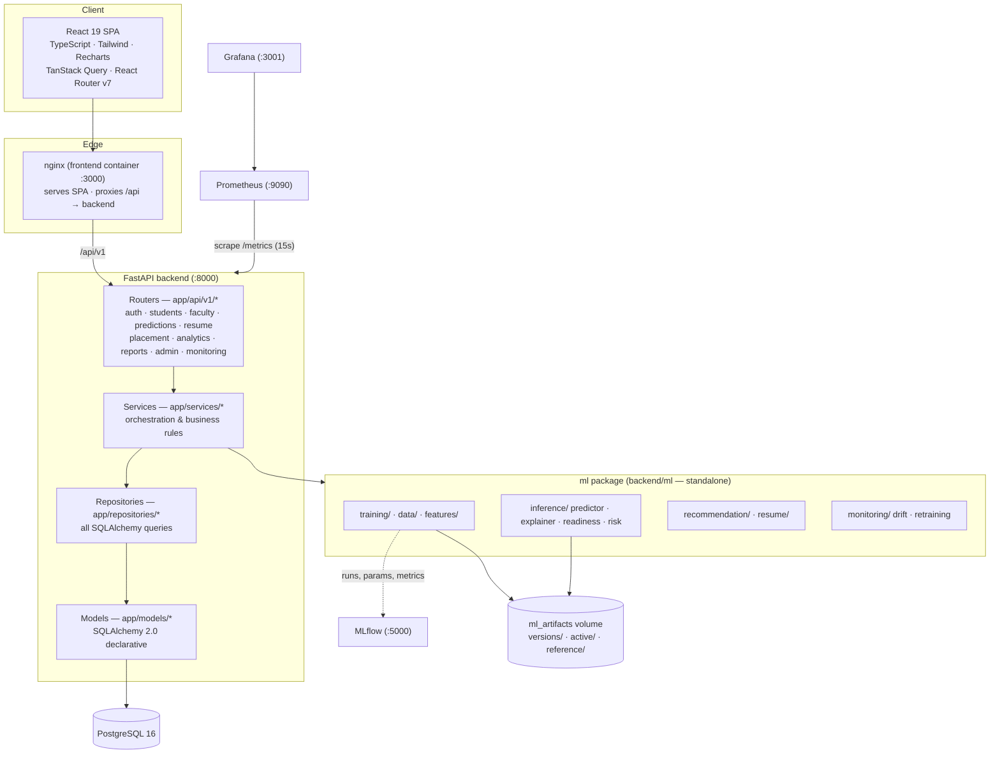
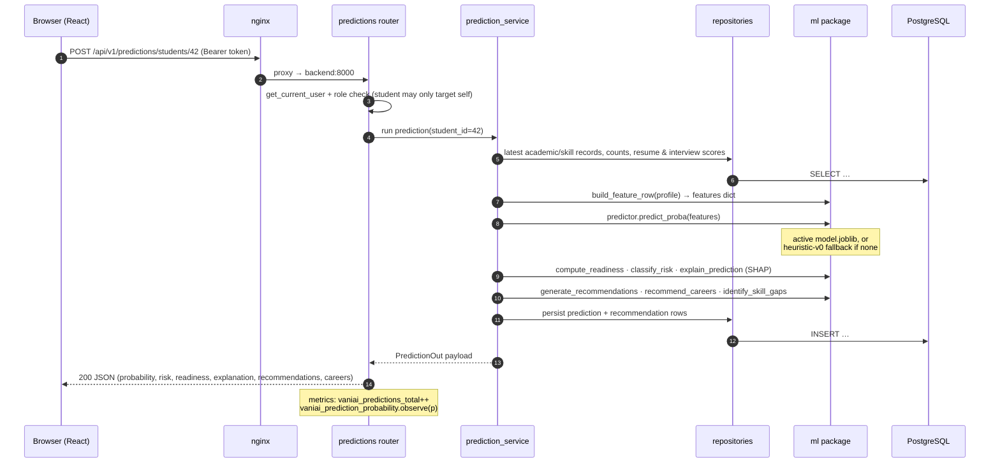
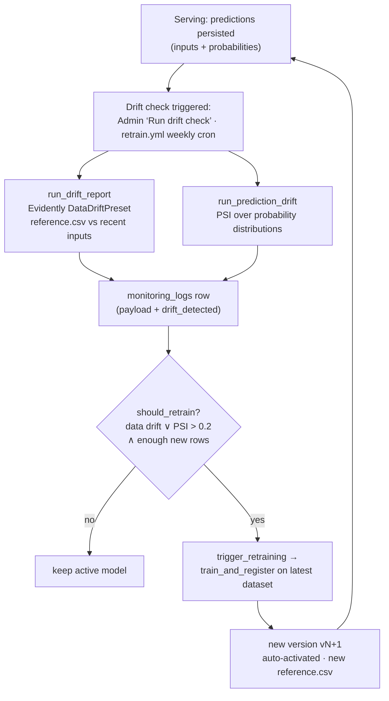
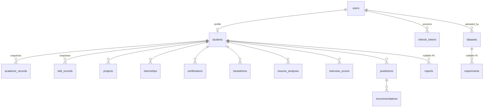

# Architecture

VaniAI is a clean-architecture FastAPI backend, a standalone Python ML package, and a React 19 SPA, wired together by an MLOps loop (MLflow, DVC, Evidently, Prometheus, Grafana). This document describes the layers, the runtime flows, the database schema, and the key design decisions.

---

## 1. System components

## 2. Backend: clean architecture layers

Requests flow strictly downward; each layer only knows the one beneath it.

| Layer | Location | Responsibility | Must not |
|---|---|---|---|
| **Routers** | `app/api/v1/*.py` | HTTP concerns: request/response schemas (Pydantic v2), auth dependencies (`get_current_user`, `require_roles`), status codes | contain business logic or queries |
| **Services** | `app/services/*.py` | Business rules and orchestration; raise domain exceptions (`NotFoundError`, `PermissionDeniedError`, `ValidationError`, `ConflictError`) | import FastAPI or touch `Request`/`Response` |
| **Repositories** | `app/repositories/*.py` | All database access via SQLAlchemy 2.0; pagination, filtering | contain business rules |
| **Models** | `app/models/*.py` | Declarative table definitions (Mapped/DeclarativeBase) | — |
| **Core** | `app/core/*.py` | `config.py` (pydantic-settings), `database.py` (engine/session), `security.py` (JWT + bcrypt), `exceptions.py`, `logging_conf.py`, `metrics.py` (custom Prometheus metrics) | — |

Domain exceptions raised in services are mapped to HTTP responses (404/403/422/409) by global handlers registered in `app/main.py`, so services stay HTTP-agnostic and error envelopes are uniform: `{"detail": "<message>"}`.

### The standalone `ml` package

`backend/ml/` has **no dependency on FastAPI, SQLAlchemy, or the app** — it operates on plain dicts, DataFrames, and file paths. This means:

- the same code runs inside API request handlers, background training tasks, the seed script, DVC stages (`dvc repro`), and the scheduled `retrain.yml` job;
- it is unit-testable without a database;
- the model contract is explicit: `ml/features/engineering.py::FEATURE_COLUMNS` defines the exact 15-feature input vector (plus 3 engineered columns) shared by training, inference, drift detection, and the frontend's label map.

Services are the only bridge: e.g. `prediction_service.py` reads records via repositories, builds a feature dict, calls the ml package, and persists results.

## 3. Request flow — running a prediction

`POST /api/v1/predictions/students/{student_id}` executes the full inference pipeline synchronously and persists the result:

## 4. Training flow

Triggered by `POST /api/v1/admin/training/start` (FastAPI BackgroundTasks → `training_service.run_training`), the seed script, `dvc repro`, or the retraining job. Core entry point: `ml/training/train.py::train_and_register`.

```mermaid
flowchart LR
    UP["Admin uploads CSV<br/>POST /admin/datasets/upload"] --> VAL{"validate_dataframe"}
    VAL -- "errors" --> INV["dataset status = invalid<br/>validation_errors stored"]
    VAL -- "ok" --> CLEAN["clean_dataframe<br/>clip ranges · impute medians · drop dupes"]
    CLEAN --> FE["feature engineering<br/>FEATURE_COLUMNS + academic/skill/experience indexes"]
    FE --> SPLIT["stratified 80/20 split<br/>random_state=42"]
    SPLIT --> C1["LogisticRegression"]
    SPLIT --> C2["RandomForest (300 trees)"]
    SPLIT --> C3["XGBoost (300, lr=0.1, depth=5)"]
    C1 & C2 & C3 --> EVAL["evaluate: accuracy · precision · recall<br/>f1 · roc_auc · confusion matrix"]
    EVAL -. "one MLflow run per candidate<br/>(try/except — optional)" .-> MLF["MLflow"]
    EVAL --> BEST["select best by roc_auc"]
    BEST --> REG["register_model →<br/>versions/vN/model.joblib + metadata.json"]
    REG --> ACT["activate_version → active/"]
    REG --> REF["reference/reference.csv<br/>(drift baseline)"]
    ACT --> RELOAD["reload_predictor — API serves vN"]
```

Every candidate runs inside an sklearn `Pipeline` with a `StandardScaler`, so scaling is captured in the serialized artifact and inference needs no separate preprocessing step.

## 5. Drift detection & retraining loop

Results surface in three places: the admin **Monitoring** page (`GET /api/v1/monitoring/drift`), the `vaniai_drift_share` Prometheus gauge on the Grafana dashboard, and the `monitoring_logs` history table.

## 6. Database schema

All tables use integer autoincrement PKs, timezone-aware UTC `created_at`/`updated_at`, and indexed foreign keys.

| Table | Purpose | Notable columns |
|---|---|---|
| `users` | All accounts, any role | `email` (unique, indexed), `hashed_password`, `role` (`student`\|`faculty`\|`placement_officer`\|`admin`), `is_active` |
| `refresh_tokens` | Persisted refresh sessions | `token_hash` (sha256, indexed), `expires_at`, `revoked` |
| `students` | Student profile, 1:1 with a user | `register_number` (unique), `department` (CSE/IT/ECE/EEE/MECH/CIVIL), `batch`, `semester` |
| `academic_records` | Append-only academic snapshots | `cgpa` (0–10), `tenth_percentage`, `twelfth_percentage`, `attendance_percentage`, `recorded_at` |
| `skill_records` | Append-only skill snapshots | `coding_score`, `aptitude_score`, `communication_score`, `technical_skill_score`, `leadership_score`, `recorded_at` |
| `projects` / `internships` / `certifications` / `hackathons` | Experience sub-resources | counts feed the feature vector |
| `resume_analyses` | Resume analyzer outputs | `resume_score`, `ats_score`, `extracted` (JSON), `missing_sections` (JSON), `suggestions` (JSON) |
| `interview_scores` | Faculty-entered mock interview results | `mock_interview_score`, `confidence_level`, `entered_by` FK→users |
| `predictions` | Every model run | `model_version`, `placement_probability`, `risk_level`, `risk_reasons` (JSON), `readiness` (JSON), `explanation` (JSON) |
| `recommendations` | Generated actions per prediction | `category`, `priority`, `text`, `status` (default `active`) |
| `reports` | Generated PDFs | `report_type` (`student`\|`faculty`\|`placement`\|`department`), `file_path`, `generated_by` |
| `datasets` | Uploaded training CSVs | `row_count`, `status` (`uploaded`\|`validated`\|`invalid`\|`used`), `validation_errors` (JSON) |
| `experiments` | Training runs | `mlflow_run_id`, `model_type`, `params`/`metrics` (JSON), `status` (`running`\|`completed`\|`failed`) |
| `model_versions` | The model registry index | `version` (unique, `"v3"`), `metrics` (JSON), `artifact_path`, `is_active` |
| `monitoring_logs` | Drift/system check history | `metric_type` (`data_drift`\|`prediction_drift`\|`system`), `payload` (JSON), `drift_detected` |

**History semantics:** the *latest* `academic_records` / `skill_records` row per student holds the current values; the full ordered history powers the progress charts. `PUT /students/me` appends a new snapshot whenever academic or skill values change (no destructive updates → free auditability and trends).

## 7. Frontend architecture

- **State:** TanStack Query v5 owns all server state (caching, invalidation, `refetchInterval: 5000` polling while training/drift jobs are `running`); React context only for auth (`use-auth.tsx`) and theme (`use-theme.tsx`).
- **API layer:** a single axios instance (`lib/api-client.ts`, baseURL `/api/v1`) with a Bearer-token request interceptor and a single-flight 401→refresh→retry interceptor; typed endpoint modules in `lib/api.ts` are the only way pages talk to the network.
- **Types:** `src/types/index.ts` mirrors backend response shapes 1:1 in snake_case — no mapping layer, so a contract change is a compile error.
- **Routing:** role-gated route trees (`/student/*`, `/faculty/*`, `/placement/*`, `/admin/*`) behind `RequireAuth`/`RequireRole` guards with a role→home redirect map.
- **Charts:** all Recharts usage goes through theme-aware wrappers in `components/charts/` fed by a validated palette (`lib/chart-colors.ts`); risk is always encoded as icon + label + color, never color alone.

## 8. Design decisions

### JSON columns for nested payloads (portability)
Prediction explanations, readiness breakdowns, risk reasons, recommendation payloads, dataset validation errors, and monitoring payloads are stored as JSON columns rather than exploded into satellite tables. Rationale: these blobs are written once, read whole, and never queried relationally; JSON keeps the schema stable as ML outputs evolve and works identically on PostgreSQL (production) and SQLite (CI test database).

### Heuristic fallback predictor (graceful cold start)
`PlacementPredictor.load()` returns a deterministic weighted-sigmoid heuristic (`model_version="heuristic-v0"`, `is_fallback=True`) when no trained artifact exists. Every feature — dashboards, explanations (pseudo-SHAP from weight × deviation), recommendations — works before the first training run. The admin UI surfaces a fallback warning, and `/api/v1/monitoring/health` exposes `is_fallback` so operators can't miss it.

### Versioned filesystem model registry
Models are immutable directories: `{MODEL_DIR}/versions/v{n}/model.joblib + metadata.json`, with deployment = copying to `{MODEL_DIR}/active/` and reloading the cached predictor singleton. Rationale: zero extra infrastructure, atomic activation, trivially auditable (metadata records metrics, feature columns, dataset, timestamp), instant rollback by re-deploying any prior version from the admin UI, and the `model_versions` DB table serves as the queryable index. MLflow complements this with experiment history but is deliberately not on the serving path.

### MLflow as optional, never load-bearing
All MLflow logging is wrapped in try/except; with `MLFLOW_TRACKING_URI` empty it writes to local `./mlruns`. Training and serving never fail because a tracking server is down.

### Token security
Refresh tokens are stored **sha256-hashed**, rotated on every refresh, and revoked on logout — a leaked database dump yields no replayable tokens. Access tokens stay short-lived (30 min); passwords use bcrypt (pinned `bcrypt==4.0.1` for passlib compatibility).

### Snapshot-based history over mutable rows
Academic and skill values are appended as timestamped snapshots instead of updated in place, giving progress charts and longitudinal analytics for free (see §6).

### Explicit feature contract
The 15 base features + 3 engineered indexes are defined once (`FEATURE_COLUMNS`, `ENGINEERED_COLUMNS`, `FEATURE_LABELS`) and reused by training, inference, SHAP explanation, drift reference data, and the frontend label map — one source of truth prevents train/serve skew.

---

See also: [API Reference](API.md) · [MLOps](MLOPS.md) · [Contracts (binding spec)](CONTRACTS.md)
