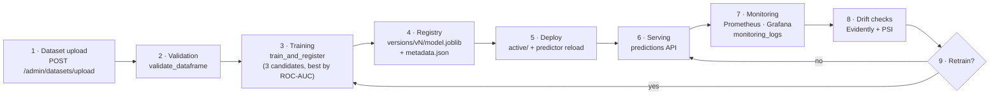

# MLOps Guide

This document describes the full machine-learning lifecycle in VaniAI — from a raw CSV to a served, monitored, and automatically retrained model — and the tooling around it: MLflow, DVC, Evidently, Prometheus, and Grafana.

---

## 1. Lifecycle at a glance



Every stage is reachable three ways: through the **admin UI** (Datasets / Models / Monitoring pages), through the **API** (`/api/v1/admin/*`, `/api/v1/monitoring/*`), and from the **command line / CI** (`python -m ml.training.train`, `dvc repro`, `retrain.yml`).

---

## 2. The feature contract

Training, inference, SHAP explanations, drift detection, and the frontend all share one feature definition in `backend/ml/features/engineering.py`:

```python
FEATURE_COLUMNS = [
    "cgpa", "tenth_percentage", "twelfth_percentage", "attendance_percentage",
    "coding_score", "aptitude_score", "communication_score",
    "technical_skill_score", "leadership_score",
    "internship_count", "project_count", "certification_count", "hackathon_count",
    "resume_score", "mock_interview_score",
]
TARGET_COLUMN = "placed"  # 0/1
```

Three engineered features are appended by `add_engineered_features(df)` before training and inference (`ENGINEERED_COLUMNS = ["academic_index", "skill_index", "experience_index"]`):

| Engineered column | Formula |
|---|---|
| `academic_index` | mean of `cgpa*10`, `tenth_percentage`, `twelfth_percentage` |
| `skill_index` | mean of `coding_score`, `aptitude_score`, `technical_skill_score` |
| `experience_index` | `min(internships,3)/3·40 + min(projects,6)/6·30 + min(certs,5)/5·15 + min(hackathons,5)/5·15` |

The model always trains on `FEATURE_COLUMNS + ENGINEERED_COLUMNS`. At inference time, `build_feature_row(profile)` normalizes a raw profile dict (missing counts → `0`, missing scores → `50.0`, missing CGPA → `6.0`) so the pipeline never sees an incomplete row. Human-readable labels for charts come from `FEATURE_LABELS` in the same module (mirrored in `frontend/src/lib/constants.ts`) — one source of truth, no train/serve skew.

---

## 3. Stage 1–2: Dataset upload and validation

Admins upload a training CSV at **Admin → Datasets** (`POST /api/v1/admin/datasets/upload`, multipart CSV).

**Expected columns:** the 15 `FEATURE_COLUMNS` plus the `placed` target (0/1). Identity columns (`register_number`, `name`, `department`, `batch`) may be present — the synthetic generator produces them — and are ignored by training.

Each upload is validated immediately by `ml/data/validation.py::validate_dataframe(df) -> (ok, errors)` and stored as a `datasets` row:

| `status` | Meaning |
|---|---|
| `uploaded` | Received, not yet validated |
| `validated` | Passed validation — eligible for training |
| `invalid` | Failed validation; `validation_errors` (JSON) lists every problem |
| `used` | Has been used for a training run |

Before the split, `ml/data/cleaning.py::clean_dataframe` clips values to their legal ranges (scores 0–100, CGPA 0–10), imputes missing numerics with column medians, and drops duplicate rows.

**Need data?** A stdlib-only synthetic generator ships with the project:

```powershell
python -m ml.data.generate_dataset --rows 2000 --out data/sample_students.csv
```

It produces realistic correlations (higher CGPA / coding scores / internship counts raise placement odds) with roughly 55% positive labels.

---

## 4. Stage 3: Training

Trigger from **Admin → Models → Start Training** (`POST /api/v1/admin/training/start` with `{dataset_id}` → `202 {experiment_id, status: "running"}`), from the seed script, from `dvc repro`, or directly:

```powershell
python -m ml.training.train --dataset data/sample_students.csv
```

Training runs as a FastAPI `BackgroundTask` (`training_service.run_training`), so the API stays responsive; the admin UI polls the experiment status every 5 seconds until it leaves `running`.

`ml/training/train.py::train_and_register(dataset_path, model_dir, experiment_name="vaniai-placement")` does:

1. **Load → validate → clean** the CSV (invalid data aborts the run; the experiment row is marked `failed`).
2. **Feature engineering**, then a **stratified 80/20 train/test split** (`random_state=42`).
3. Fit three candidates, each inside an sklearn `Pipeline` with a `StandardScaler` (so scaling is baked into the serialized artifact):
   - `LogisticRegression(max_iter=1000)`
   - `RandomForestClassifier(n_estimators=300, random_state=42)`
   - `XGBClassifier(n_estimators=300, learning_rate=0.1, max_depth=5, eval_metric="logloss", random_state=42)`
4. **Evaluate** each candidate (`ml/training/evaluate.py`): `accuracy`, `precision`, `recall`, `f1`, `roc_auc`, plus the confusion matrix.
5. **Select the best by `roc_auc`** and log every candidate as an MLflow run (see §6).
6. **Register and activate** the winner (see §5) and write the drift baseline.

Return value: `{"version", "model_type", "metrics", "candidates": {name: metrics}, "mlflow_run_id" | None}`. Each run is also persisted as an `experiments` row (`params`, `metrics`, `status`: `running` → `completed`/`failed`, timings, `mlflow_run_id`) — visible at **Admin → Models → Training history** (`GET /api/v1/admin/training/history`).

---

## 5. Stage 4–5: Model registry and deployment

The registry is a versioned directory tree under `MODEL_DIR` (default `./ml_artifacts`, a named volume in Docker), indexed by the `model_versions` table:

```
ml_artifacts/
├── versions/
│   ├── v1/
│   │   ├── model.joblib        # sklearn Pipeline (scaler + model)
│   │   └── metadata.json       # {version, model_type, metrics, feature_columns, trained_at, dataset_path}
│   └── v2/ ...
├── active/                     # the deployed model (copy of one version)
│   ├── model.joblib
│   └── metadata.json
└── reference/
    └── reference.csv           # cleaned training frame — drift baseline
```

- Versions are immutable and sequential (`v1`, `v2`, …) — `register_model` writes the artifact + metadata and creates the `model_versions` row.
- **Deployment = activation**: `activate_version(version, model_dir)` copies the version into `active/`. Training auto-activates its winner; any version can be (re)deployed later via **Admin → Models → Deploy** (`POST /api/v1/admin/models/{version}/deploy`), which also hot-reloads the serving predictor (`reload_predictor`) — no restart needed. Rollback is just deploying an older version.
- Every training run refreshes `reference/reference.csv`, so the drift baseline always matches the active model's training data.

**Serving** uses a cached singleton (`ml/inference/predictor.py::get_predictor`). If no artifact exists yet (fresh install, before the first training), `PlacementPredictor.load()` returns a deterministic **heuristic fallback** — a weighted sigmoid over normalized features with `model_version="heuristic-v0"` and `is_fallback=True`. The whole platform works in fallback mode; the admin dashboard and `GET /api/v1/monitoring/health` surface the fallback flag so it cannot go unnoticed.

---

## 6. MLflow

**What gets logged.** Every training run logs one MLflow run **per candidate** (params, metrics, and the model artifact) under the experiment **`vaniai-placement`**. The winning run's `mlflow_run_id` is stored on the `experiments` and `model_versions` rows, tying the DB registry to MLflow history.

**Never load-bearing.** All MLflow calls are wrapped in try/except: training succeeds and serving is unaffected if the tracking server is down or unconfigured.

| Setup | `MLFLOW_TRACKING_URI` | Behavior |
|---|---|---|
| Local dev (default) | *(empty)* | Runs logged to a local `./mlruns` directory; inspect with `mlflow ui` |
| Docker Compose | `http://mlflow:5000` | The `mlflow` service uses the second `mlflow` PostgreSQL database as its backend store; UI at http://localhost:5000 |
| Dedicated server | your URL | See [DEPLOYMENT.md](DEPLOYMENT.md) — recommended for team-scale tracking |

In the MLflow UI, compare candidates within an experiment by `roc_auc` (the selection metric), inspect per-run params (e.g. `n_estimators`, `learning_rate`), and download logged model artifacts.

---

## 7. DVC

DVC makes the data → model pipeline reproducible and versionable. `dvc.yaml` (repo root) defines two stages:

| Stage | Command | Deps | Outs |
|---|---|---|---|
| `generate_data` | `python -m ml.data.generate_dataset --rows 2000 --out data/sample_students.csv` | generator code | `data/sample_students.csv` |
| `train` | `python -m ml.training.train --dataset ../data/sample_students.csv` (run from `backend/`) | `backend/ml/` code + the dataset | `ml_artifacts/` |

`params.yaml` holds the model hyperparameters (candidate settings such as `n_estimators`, `learning_rate`, `max_depth`, and the split configuration). `train.py` reads it when present, so a params edit is a pipeline change DVC can detect.

Typical workflow:

```powershell
dvc repro            # re-run only the stages whose deps/params changed
dvc params diff      # see which hyperparameters changed vs. last commit
dvc dag              # visualize the stage graph
dvc push / dvc pull  # sync data + artifacts with a DVC remote (S3/GCS/azure/local)
```

Git tracks the pipeline definition and `dvc.lock`; DVC tracks the heavy files. A teammate with repo access and `dvc pull` reproduces the exact model.

---

## 8. Drift detection

Two complementary checks run against live traffic, triggered from **Admin → Monitoring → Run drift check** (`POST /api/v1/monitoring/drift/run`) or on a schedule. Results are persisted to `monitoring_logs` (`metric_type`: `data_drift` | `prediction_drift`, `payload` JSON, `drift_detected`) and served by `GET /api/v1/monitoring/drift`.

### 8.1 Data drift — Evidently

`ml/monitoring/drift.py::run_drift_report(reference_df, current_df)` compares the training baseline (`reference/reference.csv`) with recent prediction inputs using **Evidently 0.4.40**'s `Report(metrics=[DataDriftPreset()])`. Evidently picks a suitable statistical test per feature (e.g. Kolmogorov–Smirnov for numerics) and flags the dataset as drifted when enough individual features drift. VaniAI condenses the report to:

```json
{"data_drift_detected": true, "share_drifted": 0.27, "drifted_features": ["coding_score", "resume_score"], "n_features": 15}
```

`share_drifted` (0–1) is the fraction of features whose distribution shifted — shown as a meter on the Monitoring page and exported as the `vaniai_drift_share` Prometheus gauge.

### 8.2 Prediction drift — PSI

`run_prediction_drift(ref_probs, cur_probs)` compares the distribution of *output probabilities* between the reference period and recent predictions using the **Population Stability Index**, computed manually over equal-width probability buckets:

```
PSI = Σ over buckets  (cur% − ref%) × ln(cur% / ref%)
```

| PSI | Interpretation |
|---|---|
| < 0.1 | Stable — no action |
| 0.1 – 0.2 | Moderate shift — watch |
| **> 0.2** | Significant shift — **`drift_detected = true`** (VaniAI's threshold) |

PSI catches problems data drift can miss (and vice versa): the inputs may look stable while the model's outputs shift because of changed feature interactions — or the population changes in ways the model absorbs gracefully.

---

## 9. Prometheus metrics

`prometheus-fastapi-instrumentator` exposes **`GET /metrics`** (no `/api/v1` prefix). Prometheus scrapes it via the `vaniai-backend` job (`backend:8000/metrics`, 15-second interval — see `mlops/prometheus/prometheus.yml`).

Custom metrics defined in `app/core/metrics.py`:

| Metric | Type | Meaning |
|---|---|---|
| `vaniai_predictions_total` | Counter | Predictions served since process start |
| `vaniai_prediction_probability` | Histogram | Distribution of predicted probabilities — a live view of model output |
| `vaniai_active_model_info` | Gauge (label `version`) | Which model version is serving (e.g. `v3`, `heuristic-v0`) |
| `vaniai_drift_share` | Gauge | Share of drifted features from the latest drift check |

Plus the instrumentator's default HTTP metrics (request counts and duration histograms per handler/status), which power the request-rate and latency panels.

Useful PromQL:

```promql
rate(vaniai_predictions_total[5m])                                  # prediction throughput
histogram_quantile(0.5, rate(vaniai_prediction_probability_bucket[1h]))  # median predicted probability
vaniai_drift_share                                                  # current drift level
vaniai_active_model_info                                            # active version (label)
```

---

## 10. Grafana dashboard

Grafana runs at **http://localhost:3001** (Grafana's default `admin`/`admin` credentials unless `GF_SECURITY_ADMIN_PASSWORD` is set — change it in production). Provisioning under `mlops/grafana/provisioning/` auto-configures the Prometheus datasource and the **VaniAI Overview** dashboard, so a fresh container comes up fully wired.

Dashboard panels and how to read them:

| Panel | Source | What to look for |
|---|---|---|
| Request rate / latency | instrumentator histograms | Traffic shape; latency spikes during training runs (training is background, so they should be minor) |
| Predictions total | `vaniai_predictions_total` | Adoption; flat lines during business hours are suspicious |
| Prediction probability distribution | `vaniai_prediction_probability` | Shape shifts (e.g. mass drifting toward 0) — an early, continuous complement to the PSI check |
| Drift share | `vaniai_drift_share` | Trending up across checks ⇒ schedule retraining before the 0.2 PSI / drift alarms fire |
| Active model version | `vaniai_active_model_info` | Confirms deploys; `heuristic-v0` in production means no trained model is active |

Suggested alert rules (Grafana alerting on the same series): `vaniai_drift_share > 0.3` for 1h, error-rate ratio over the instrumentator counters, and `vaniai_active_model_info{version="heuristic-v0"} == 1` in production.

---

## 11. Retraining policy

Three triggers, one code path — everything funnels into `train_and_register`, producing a new version that is auto-activated with a fresh drift baseline.

### 11.1 Drift-gated (recommended)

`ml/monitoring/retraining.py::should_retrain(drift_result, prediction_drift, min_new_rows, new_rows) -> (bool, reason)` encodes the policy:

> Retrain when **data drift is detected or prediction PSI > 0.2**, *and* at least `min_new_rows` new rows have accumulated since the last training — retraining on a handful of new samples adds noise, not signal.

`trigger_retraining(dataset_path, model_dir)` executes the retrain by calling `train_and_register`.

### 11.2 Manual (admin UI)

**Admin → Models → Trigger Retraining** (`POST /api/v1/admin/retraining/trigger` → `202 {experiment_id, status: "running"}`) retrains in the background on the latest `used` dataset. Use after a drift alarm, or after uploading a fresher dataset (then prefer **Start Training** on that specific dataset).

### 11.3 Scheduled (GitHub Actions)

`.github/workflows/retrain.yml` runs **every Sunday at 02:00 UTC** (plus `workflow_dispatch` for on-demand runs). It builds the backend image, produces a dataset (synthetic generator as a stand-in — swap for `dvc pull` or a dataset export in real infra), runs `python -m ml.training.train --dataset data/sample_students.csv` inside the container, and uploads the resulting `ml_artifacts` as a build artifact (30-day retention). The publish step is a documented placeholder: wire it to a DVC remote, a remote MLflow registry, or sync to the production `ml_artifacts` volume followed by `POST /api/v1/admin/models/{version}/deploy`.

### 11.4 Safety properties

- **Nothing deploys silently into a worse state you can't leave:** every retrain creates a *new* immutable version; the previous one remains one click from redeployment.
- **Champion metrics are recorded** in `metadata.json`, `model_versions.metrics`, and MLflow — compare `roc_auc` before trusting an auto-activated model, and roll back if the new version regressed.
- **MLflow-optional:** retraining works with no tracking server (see §6).

---

## 12. Command quick reference

```powershell
# generate a synthetic dataset (from backend/, venv active)
python -m ml.data.generate_dataset --rows 2000 --out data/sample_students.csv

# train + register + activate (CLI)
python -m ml.training.train --dataset data/sample_students.csv

# reproduce the DVC pipeline (repo root)
dvc repro

# Makefile shortcut
make train

# run a drift check via the API (admin token required)
# POST http://localhost:8000/api/v1/monitoring/drift/run
```

See also: [Architecture](ARCHITECTURE.md) · [Deployment](DEPLOYMENT.md) · [API Reference](API.md)
